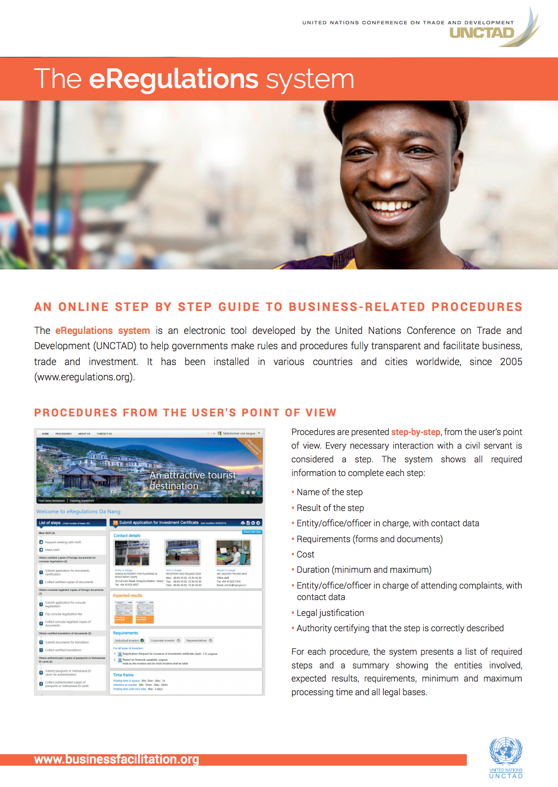

<header>
	<h1>eRegulations <small>Information portals on administrative procedures</small></h1>
</header>

	  
  

		
Making administrative procedures transparent, swift and efficient is an essential part of an enabling environment for private sector development, good governance and the rule of law. UNCTAD has developed an electronic tool called eRegulations to help governments make rules and procedures fully transparent and to facilitate business, trade and investment.

		
This system contributes to greater transparency and efficiency in the public service and improved governance. It has been installed in various countries and cities worldwide, since 2005.

		
		
This site is aimed to eRegulations expert and developers. It provides all the documentation needed to <strong>fill</strong>, <strong>install</strong> and <strong>configure</strong> an eRegulations system.
	

<ul class="categorized-view view-col-3" style="margin-top:30px;">
  <li style="height: 227px;">
    <h5>Documentation</h5>
    <a href="">Index</a>
    <a href="">System philosophy</a>
    <a href="">Public interface</a>
    <a href="">Administrative interface</a>
    <a href="">Home page</a>
    <a href="">Menu page</a>
  </li>

  <li style="height: 159px;">
    <h5>Installation</h5>
    <a href="">Index</a>
    <a href="">Hosting requirements</a>
    <a href="">Installation on local server</a>
    <a href="">Migration of the data</a>
    <a href="">Source</a>
  </li>

  <li style="height: 159px;">
    <h5>Architecture</h5>
    <a href="">Index</a>
    <a href="">Admin web app</a>
    <a href="">Public web app</a>
    <a href="">Translator web app</a>
    <a href="">Data API server</a>
    <a href="">CR Alerts CLI</a>
  </li>
</ul>
  

  

	  
  
  

